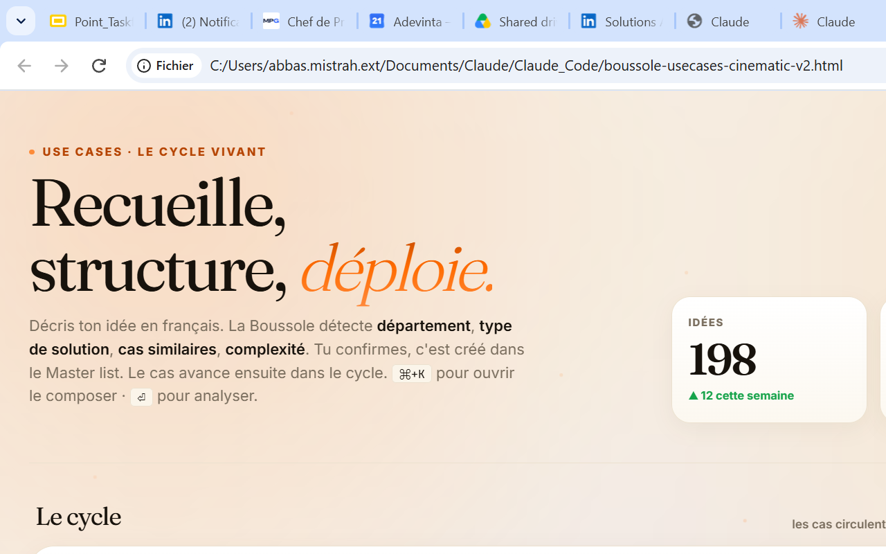
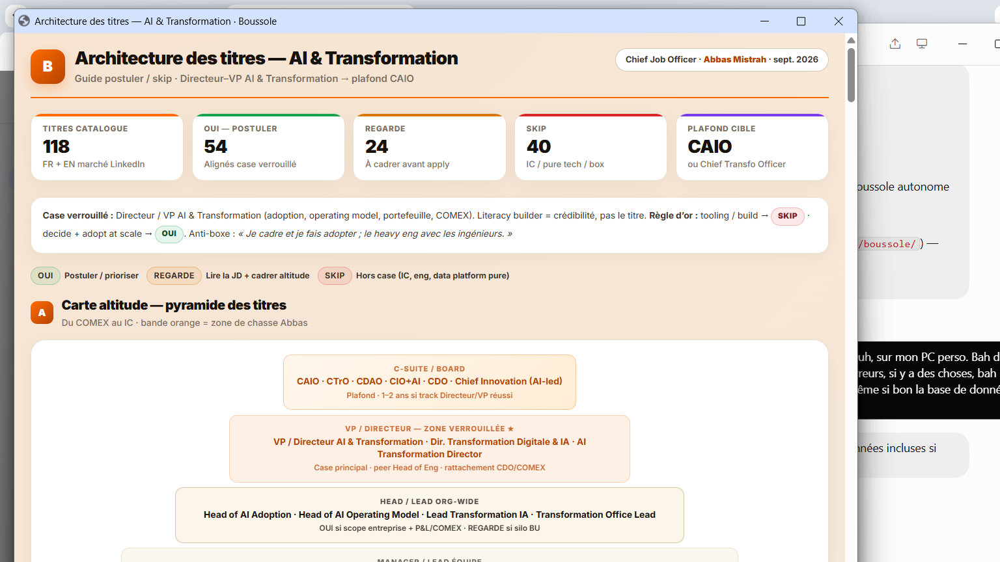

# Boussole

Operating cockpit for the AI portfolio — selection, adoption, governance, proof.

  

  

Not a dashboard toy. The system that keeps the use-case portfolio board-ready.

**Abbas Mistrah** · Directeur / VP AI & Transformation

---

[mistrah.com](https://mistrah.com) · [ORCID](https://orcid.org/0009-0009-5944-585X)
