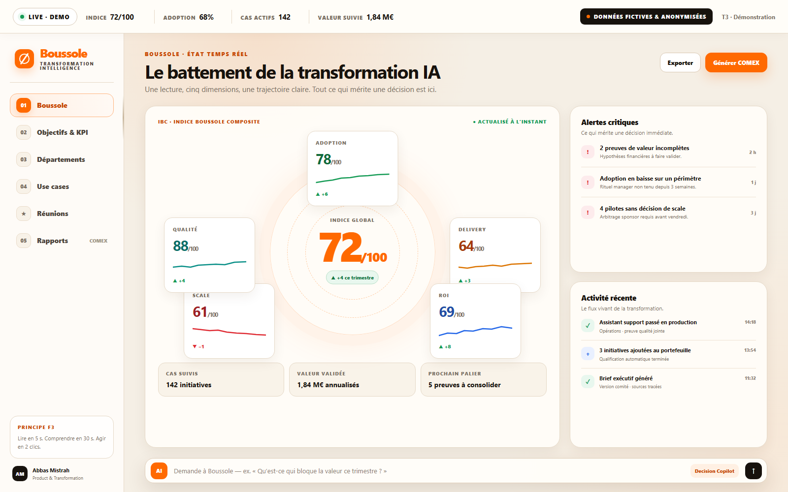
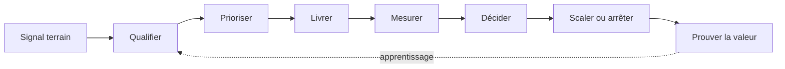
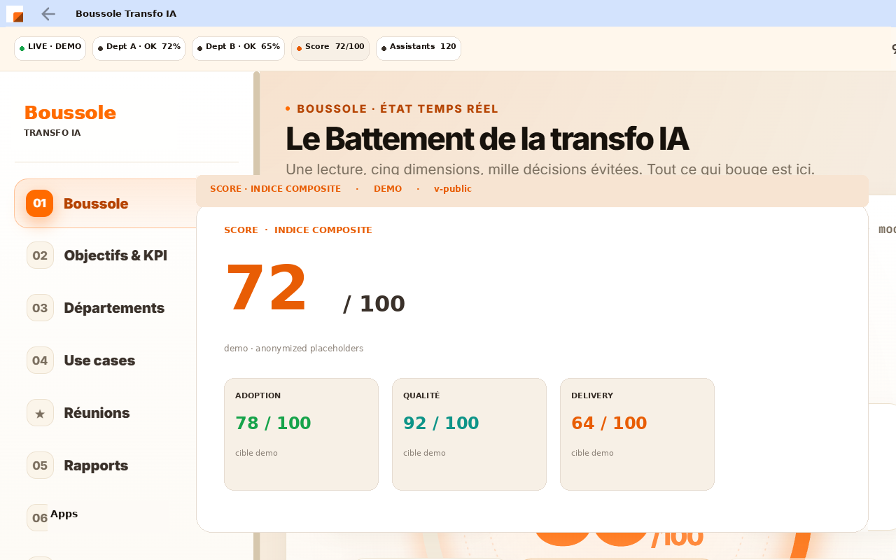
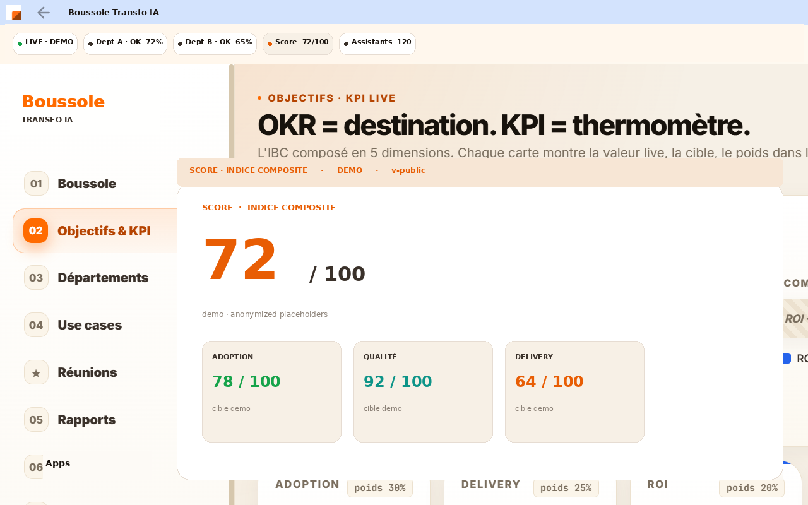
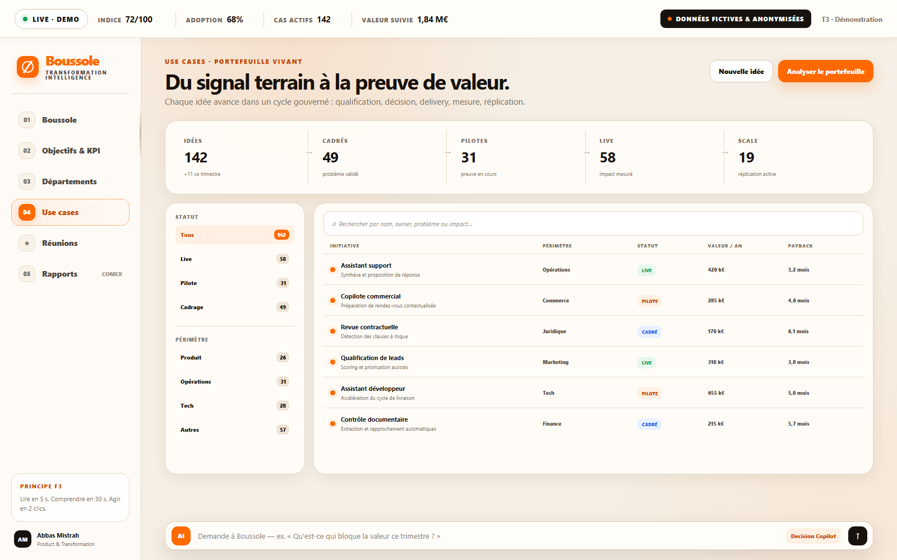
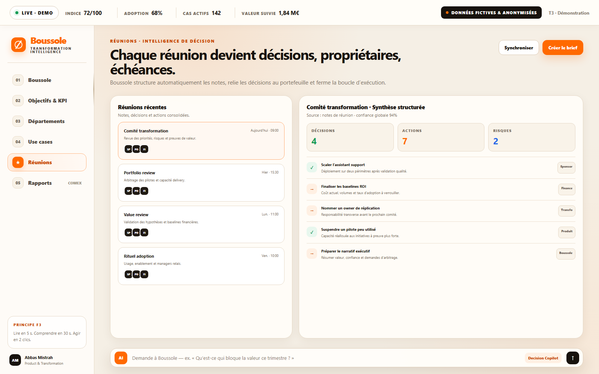
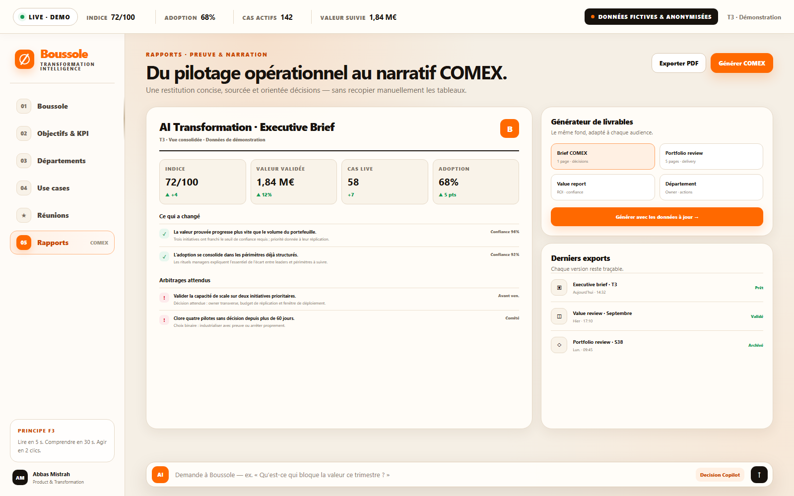
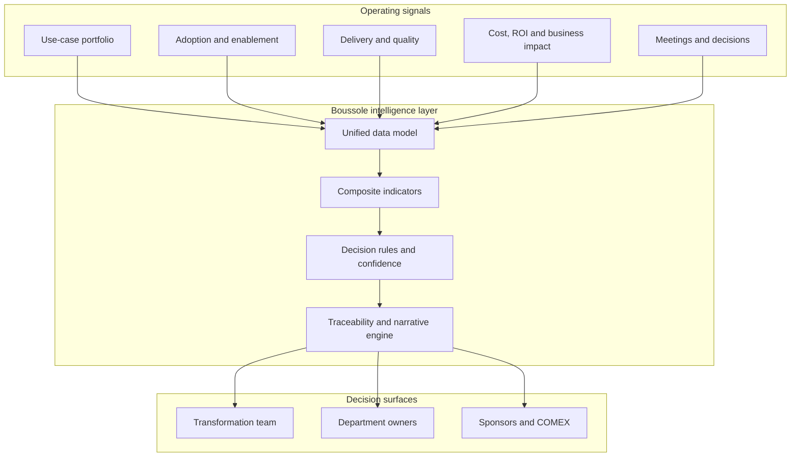

# 🧭 BOUSSOLE

### Enterprise AI Transformation Intelligence

**From scattered initiatives to governed execution and proof of value.**

  

> **Boussole is the decision layer for enterprise AI transformation.** It connects strategy, portfolio execution, adoption, risk and value so leaders can see what is moving, decide what matters and prove what the transformation creates.

---

## Why Boussole

Enterprise AI rarely fails because teams lack ideas. It fails because initiatives are scattered, ownership is unclear, evidence arrives too late and activity is confused with value.

Boussole creates one operating picture across the transformation:

| Leadership question | Boussole answer |
|:--|:--|
| **Where are we now?** | A live composite index across adoption, delivery, ROI, scale and quality |
| **What deserves attention?** | Prioritised alerts, blockers, confidence levels and next decisions |
| **Who owns the outcome?** | Department, sponsor, owner, milestone and next action on every initiative |
| **What should scale—or stop?** | A governed portfolio from idea to proof, with explicit stage gates |
| **What value did we create?** | Traced business impact, validated assumptions and executive-ready evidence |

---

## Product system

Boussole is not a collection of dashboards. It is a connected operating system with six decision surfaces:

| Surface | Decision it supports |
|:--|:--|
| **Command Pulse** | Read the health of the transformation in seconds |
| **Objectives & KPI** | Connect strategic targets to measurable operating signals |
| **Departments** | Compare momentum, ownership and blockers across the organisation |
| **Use-case Portfolio** | Qualify, prioritise, govern and scale initiatives |
| **Decision Memory** | Turn meetings into decisions, owners and due dates |
| **Executive Evidence** | Convert live signals into a board-ready narrative |

---

## Operating loop

The loop closes the gap between **strategy**, **execution** and **evidence**. Every stage has an owner, a decision rule and a proof threshold.

---

## Product tour

### 01 — Command Pulse

The transformation at a glance: one composite index, five operating dimensions, critical alerts, recent activity and the next proof threshold.

  

### 02 — Objectives & KPI

Each strategic objective is translated into a live signal, a target, a weighting and the next concrete action required to move the score.

  

### 03 — Department Momentum

A comparable view of business-unit progress—portfolio, live initiatives, maturity, blockers and the next move—without hiding the organisational reality behind averages.

  

### 04 — Use-case Portfolio

A governed lifecycle from signal to scale. Each initiative carries a problem, owner, stage, expected value, payback and evidence status.

  

### 05 — Decision Memory

Meeting notes become structured decisions, named owners, deadlines and risks, linked back to the transformation portfolio.

  

### 06 — Executive Evidence

Live operating signals are converted into concise COMEX-ready briefs: what changed, what value is validated, where confidence is weak and which arbitrations are required.

  

---

## System architecture

### Design principles

- **F3 by default:** read in 5 seconds, understand in 30 seconds, act in 2 clicks.
- **Evidence before theatre:** no “green” status without a source, owner and confidence level.
- **Decision over reporting:** every view must make the next move obvious.
- **Value over volume:** initiative counts never substitute for adoption or realised impact.
- **One operating language:** the same definitions flow from teams to executives.

---

## Public showcase & privacy

This repository presents the **product narrative and selected interface views** of Boussole.

All public screenshots use:

- fictional or deliberately modified figures;
- generic departments, initiatives and owners;
- Boussole-only branding;
- no production records, personal data or confidential company identifiers.

The visuals demonstrate the product logic and design system; they are not exports of a production dataset.

---

## Product leadership

**Abbas Mistrah** — AI Transformation, Product & Governance  
[mistrah.com](https://mistrah.com) · [LinkedIn](https://www.linkedin.com/in/abbas-mistrah-b0b53119a) · [ORCID](https://orcid.org/0009-0009-5944-585X)

**See the system. Make the decision. Prove the value.**

